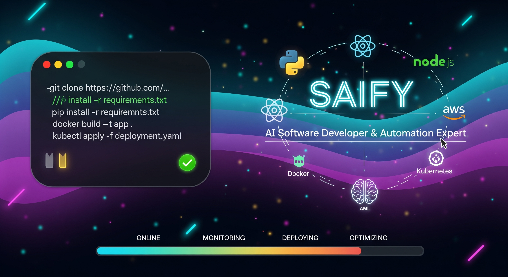

<!-- Header Banner (local asset) -->

<!-- Typing headline -->

<!-- Tech icons -->

 

<!-- Primary capability badges -->

 

<!-- Profile stats badges -->

 

<!-- Social links -->

   

---

## About

I am a **Senior AI Engineer** focused on **agentic automation**, **LLM application engineering**, and **scalable system design**.

I build production-grade AI systems that reduce manual operations, increase reliability, and unlock new capabilities across product and infrastructure.

### What I specialize in

* **AI Engineering**: LLM apps, RAG, tool-using agents, evaluation, safety, and observability
* **Automation**: n8n workflows, event-driven orchestration, integrations, and self-healing pipelines
* **Full-Stack**: React/Next.js, TypeScript, Node.js, FastAPI, API design, and performance
* **Cloud & DevOps**: AWS, Kubernetes, Docker, Terraform, CI/CD, monitoring, and SRE practices
* **Open Source**: developer tools, templates, and learning resources for AI deployment

---

## Impact (selected)

  
  
  
  

---

## Technology

### AI and ML

### Automation and Integration

### Full-Stack

### Cloud and DevOps

### Databases

---

## GitHub Analytics

---

## Featured Work

### AI-Powered Business Automation Suite

**Stack:** `n8n` `OpenAI API` `LangChain` `Node.js` `PostgreSQL` `Docker`

* Multi-agent system with reliable tool use and context routing
* High-throughput workflows handling large event volumes (100K+ per day)
* Self-healing execution with error classification, retries, and fallbacks
* Analytics layer for operational insight and SLA tracking

### Enterprise E-Commerce Platform

**Stack:** `React` `Next.js` `Node.js` `PostgreSQL` `AWS` `Kubernetes`

* Microservices architecture with auto-scaling and safe deployments
* Inventory forecasting and recommendation components
* Secure payments, fraud mitigation, and observability-first design

### Multi-Cloud Infrastructure Orchestration

**Stack:** `Terraform` `Kubernetes` `AWS` `GCP` `Prometheus` `Grafana`

* Infrastructure-as-Code across providers with repeatable environments
* Disaster recovery automation and controlled failover strategies
* Monitoring, alerting, and cost optimization workflows

### Real-Time Collaboration Platform

**Stack:** `React` `Socket.io` `Redis` `MongoDB` `Docker`

* Real-time sync with conflict management and low-latency messaging
* Permissions, auditing, and scalable session handling
* AI-assisted content improvements and formatting helpers

---

## Services

| Service Area     | Expertise                              | Outcome                                          |
| ---------------- | -------------------------------------- | ------------------------------------------------ |
| AI Engineering   | agents, RAG, evaluation, observability | reliable AI features that ship and stay stable   |
| Automation       | n8n, integrations, event pipelines     | major reduction in manual operations             |
| Full-Stack       | web apps, APIs, architecture           | production-ready delivery with performance focus |
| Cloud and DevOps | AWS, Kubernetes, CI/CD, monitoring     | faster deploys, safer operations, lower cost     |

---

## Current Focus

* Agentic AI systems (LangGraph, CrewAI, AutoGen)
* LLM evaluation, monitoring, and quality gates in production
* MLOps practices for continuous delivery and governance
* Responsible AI: safety, privacy, and bias mitigation

---

## Open Source

* AI automation templates and agent patterns
* Developer tooling and CI/CD enhancements
* Deployment-ready ML and LLM pipeline blueprints
* Tutorials and guides for practical AI engineering

---

## Contact

If you want to collaborate on AI engineering, automation, or scalable systems, reach out.

 

---

  The future belongs to teams that combine human creativity with reliable artificial intelligence.

